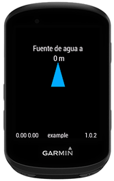
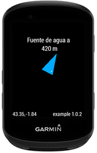

# Fountains

Data Field para dispositivos Garmin Edge que muestra la distancia y dirección de la fuente de agua más cercana durante una actividad.




## ¿Me invitas a un café?
¿Te ha gustado? Puedes apoyarme para seguir creando cosas guais ;)
[](https://paypal.me/anderware)

## Caracteristicas
```
Funciona durante una actividad Garmin.
No requiere conexión a internet.
Muestra la distancia a la fuente más cercana.
Muestra una flecha indicando la dirección de la fuente.
Datos obtenidos de OpenStreetMap.
```

## Estructura  del proyecto
```
project/
|-- resources/
|-- source/
|-- tools/
|-- README.md
|-- manifest.xml
|-- developer_key.xml
|-- monkey.jungle
```

## Dependencias
```
Python 3
Garmin Connect IQ SDK "https://developer.garmin.com/connect-iq/sdk/"
```

## Generar aplicación
```
1.- Descargar ficheros ".osm.pbf" desde https://download.geofabrik.de/  
    (Ficheros por zonas con información geográfica)  
    Dejar en la carpeta tools todos los ficheros.osm.pbf que se quieran procesar

2.- Compilar  
      
    Ejecutar script "get_fountains.py" y los argumentos necesarios
    py ./get_fountains.py <lat> <lon> <radio-km> <filtro-km> <nombre> <dispositivo>

    Uso:
    <lat>           latitud del punto de referencia para calcular el radio
    <lon>           longitud del punto de referencia para calcular el radio
    <radio-km>      el radio en km donde buscar fuentes
    <filtro-km>     distancia min en km entre fuentes
    <nombre>        nombre que aparecera en la app
    <dispositivo>   tipo de dispositivo para la compilación  
      
    Ejemplo: 
    ./get_fountains.py 43.1336 -1.6664 90 0.5 example edge530

    Explicación ejemplo:
    Busca fuentes en un radio de 90 km partiendo de la coordenada 43.1336,-1.6664 filtrando fuentes en 0.5 km.
    El nombre "example" y para el dispositivo edge530 
      
    Ficheros que genera:  
    |-  source/tiles/
                |- ConfLoader.mc        parametros de la aplicación
                |- TileLoader.mc        gestor de tiles
                |- f_x0_y0_w0_v0.mc     ficheros con las coordenadas de fuentes distribuida por tiles
                |- f_x1_y1_w1_v1.mc
                .
                |- f_xn_yn_wn_vn.mc

    |-  tools/fountains.geojson         para comprobar puntos generados en https://geojson.io/  

    |-  <name>.prg                      fichero de aplicación, la que pondremos en el Garmin

3.- Pasar app a dispositivo Garmin  
    Conectar el gps garmin usb al PC y dejar el fichero compilado .prg en la carpeta APP  
```

## Dispositivos compatibles
```
Edge 530
Edge 540
Edge 550
Edge 830
Edge 840
Edge 850
Edge 1030
Edge 1030 Plus
Edge 1040
Edge 1050
Edge Explore 2
Edge MTB
```

## Limitaciones
```
No descarga datos en tiempo real.
La información depende de la calidad de los datos de OpenStreetMap.
El tamaño de la base de datos está limitado por las restricciones de memoria de Connect IQ.
```
